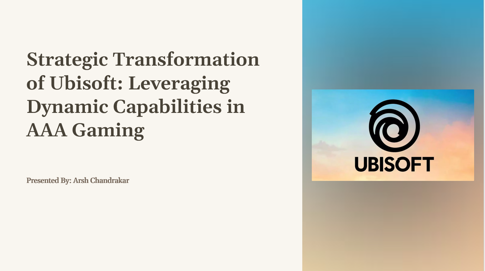

# Strategic Transformation of Ubisoft Entertainment S.A.
### Leveraging Dynamic Capabilities for AAA Dominance
*MIS Capstone Project | Syracuse University | December 2025*

## Overview
This strategic analysis examines Ubisoft's organizational transformation as the company pivots from traditional AAA publishing to a "Games as a Service" (GaaS) model built around autonomous "Creative Houses." The report applies the Dynamic Capability Framework (Sensing, Seizing, Transforming) to propose actionable strategies addressing the core challenges of modern game development: rising costs, extended timelines, and intense market competition.

## Business Context
Ubisoft operates over 45 studios with ~19,000 employees, managing billion-euro IPs such as Assassin's Creed, Far Cry, and Rainbow Six. Despite record net bookings of €2.32B in FY2023-24, the company faces structural challenges:

* Development costs exceeding $200M per AAA title
* 5+ year development cycles limiting market responsiveness
* Player expectations shifting toward persistent, evolving game worlds

## Strategic Framework
The analysis leverages three interconnected strategic thrusts:

| Capability | Focus Area | Key Initiative |
| --- | --- | --- |
| **Sensing** | Opportunity Identification | Real-time analytics replacing batch processing |
| **Seizing** | Resource Mobilization | GenAI integration for asset creation pipelines |
| **Transforming** | Organizational Renewal | Autonomous Creative Houses with end-to-end IP ownership |

Key Findings

* Operational Efficiency: Serverless analytics pipeline projected to reduce issue detection time by 80%
* Development Velocity: GenAI/PCG integration could compress cycles by 15-24 months
* Player Retention: Industrialized content delivery targeting 20% improvement in D30 retention

Analytical Tools Applied

* PESTELI Analysis (External Environment)
* Porter's Five Forces (Industry Competition)
* SWOT Analysis (Internal Assessment)
* Value Chain Mapping (Operational Processes)
* Strategic Planning Canvas (Future State)

## Author
### Arsh Chandrakar
M.S. Information Systems | Syracuse University (December 2025)
Certified Lean Six Sigma Green Belt  
[LinkedIn](https://www.linkedin.com/in/arsh-chandrakar/)
[Portfolio](https://arsh23-tech.github.io/)

License
This project is for educational and portfolio purposes. The analysis represents independent academic work and is not affiliated with Ubisoft Entertainment S.A.
